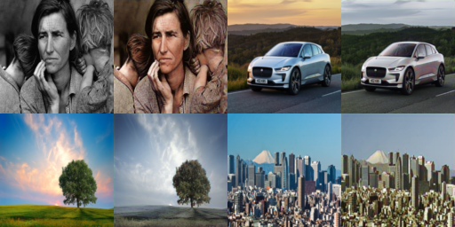

# Deep colorization

Implementation of deep learning model in Keras for image colorization. Project uses U-Net trained as Self-Attention GAN together with Perceptual loss instead of usual MAE or MSE. Model was trained for 15 hours on NVIDIA Quadro P5000 on subset of ImageNet (0.5M images). First I trained it in 64x64 resolution followed by one epoch in 128x128. Work is still in progress.



#### Requirements

- Python 3.x
- pip

#### Installation and setup

Install pip packages using
```
$ pip install -r requirements.txt
```

Add `.env` file to project root with environmental variables
```
COMET_PROJECTNAME={comet_project_name}
COMET_WORKSPACE={comet_workspace}
COMET_API_KEY={comet_api_key}
```

[optional]

There is a Docker image included that was used for training in cloud. You can build it from local Dockerfile with
```
docker build -t ml-box .
```
or get it from Docker Hub
```
docker pull tomikeska/ml-box
```

#### Usage

Train model using command
```
$ python src/train_gan.py
```

Colorize image using trained weights
```
$ python src/colorize.py --weights model/weights.h5 --source source.jpg --output output.jpg
```
